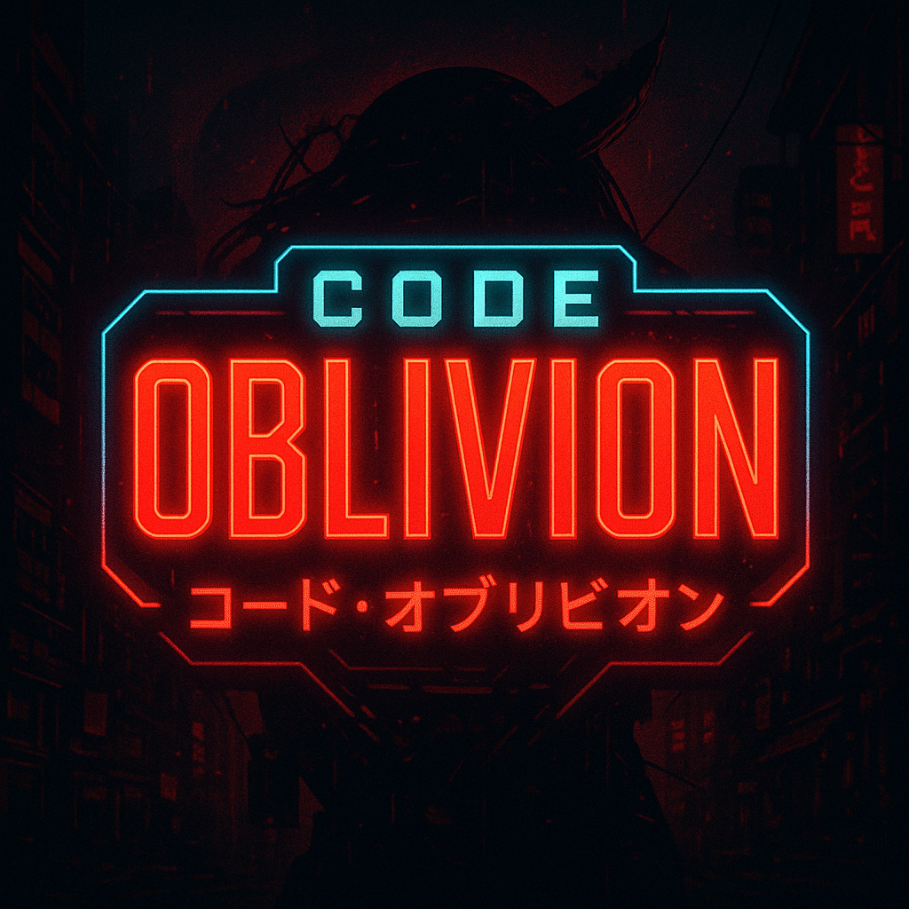

  

<h1 align="center">🚀 Code Oblivion</h1>

  Organização criada para colaboração em equipe durante o curso <strong>Fullstack</strong> da 
  <a href="https://academiadoprogramador.net" target="_blank">Academia do Programador</a> 🎓

  🌌 “Saindo do caos para a organização... uma linha de código por vez.”  

---

## 🧭 Índice

- [Sobre a Code Oblivion](#-sobre-a-code-oblivion)
- [Missão da Organização](#-missão-da-organização)
- [Tecnologias que usamos](#-tecnologias-que-usamos)
- [Como organizamos os projetos](#-como-organizamos-os-projetos)
- [Fluxo de trabalho e convenções](#-fluxo-de-trabalho-e-convenções)
- [Time Code Oblivion](#-time-code-oblivion)

---

## 🌌 Sobre a Code Oblivion

A **Code Oblivion** é uma organização criada para centralizar e organizar os trabalhos em grupo desenvolvidos durante o curso **Fullstack** da **Academia do Programador**.  

Aqui vivem:

- 🧑‍💻 Projetos de estudo e desafios em equipe  
- 🧪 Provas de conceito, protótipos e experimentos  
- 📚 Códigos que marcaram a jornada de aprendizado da turma  

> Nosso foco é aprender, evoluir em conjunto e deixar um rastro de código bem organizado pelo caminho. ✨

---

## 🎯 Missão da Organização

- 👥 **Colaborar em equipe** de forma saudável e organizada  
- 🧱 **Praticar boas práticas** de desenvolvimento (clean code, arquitetura, testes)  
- 📦 **Versionar tudo**: da primeira tela até o deploy final  
- 🚀 **Preparar o terreno** para futuros projetos pessoais e profissionais  

---

## 🛠 Tecnologias que usamos

> Cada repositório pode ter sua combinação específica, mas em geral a Code Oblivion transita por:

- 🎨 **Front-end**
  - Angular 
  - HTML5, CSS3, SCSS
  - TypeScript

- 🧠 **Back-end**
  - Node.js 
  - .NET / Web API (em alguns projetos)  

- 🗄 **Banco de Dados**
  - SQL Server / PostgreSQL / SQLite (dependendo do projeto)  

- 🧪 **Qualidade**
  - Testes unitários e/ou de integração
  - ESLint, Prettier ou equivalentes

- 🧰 **DevOps & Ferramentas**
  - Git & GitHub (claro 😄)
  - GitHub Projects / Issues
  - GitHub Actions (quando faz sentido)

---

## 🧱 Como organizamos os projetos

Em geral, tentamos seguir alguns princípios em todos os repositórios:

- 📁 **Estrutura clara de pastas**
  - `src/` bem organizado
  - Separação entre componentes, serviços, models etc.
- 🧠 **Tipagem forte**
  - Sempre que possível, usar **TypeScript** com modelos bem definidos
- 📄 **README detalhado**
  - Explicar o objetivo do projeto
  - Como rodar localmente
  - Tecnologias usadas
  - Prints / GIFs de demonstração

Checklist que tentamos manter:

- [x] Cada projeto tem um `README.md` próprio  
- [x] Commits com mensagens compreensíveis  
- [x] Branches criadas para novas features/correções  
- [x] Testes automatizados cobrindo as partes principais do código (em evolução 💪)  

---

## 🔁 Fluxo de trabalho e convenções

Para manter tudo minimamente organizado:

- 🌿 **Branches**
  - `main` / `master` → branch estável
  - `feat/nome-da-feature` → novas funcionalidades
  - `fix/nome-do-fix` → correções

- 🧠 **Commits**
  - Preferência por [Conventional Commits](https://www.conventionalcommits.org/pt-br/v1.0.0/)
  - Exemplos:
    - `feat: adicionar tela de login`
    - `fix: corrigir validação de formulário`
    - `chore: atualizar dependências`
    - `docs: atualizar readme`

- 🔍 **Mural de Issues**
  - Utilizamos o mural de **Issues** para organizar e acompanhar as atividades
  - Cada issue representa uma tarefa, ajuste ou melhoria a ser feita
  - Tags e labels ajudam a identificar prioridade, tipo de tarefa e responsável

---

## 👥 Time Code Oblivion

  
    
    

| Nome               | GitHub                                      |
| ------------------ | ------------------------------------------- | 
| Agatha Sates       | [@Agatha](https://github.com/AgathaSates)     |
| Otávio Brignoni    | [@Otávio](https://github.com/otaviobrignoni)  |         
| Alex Araldi        | [@Alex](https://github.com/AlexAraldi)        |         

---
